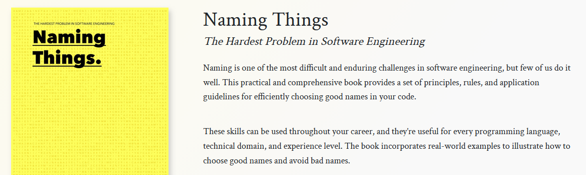

## Zu dem Workshop

## About me

-   M. Sc. in Psychology
-   Used to work for  Forschungsstelle für Psychotherapie
-   Data Scientist at Asklepios Science & Research since 2022
-   

## Timetable 


## DRY: Don't repeat yourself

This is a webR-enabled code cell in a Quarto HTML document.

```{webr-r}
fit = lm(mpg ~ am, data = mtcars)

summary(fit)
```


## Functions


## Naming things

Naming things is hard - so hard that books are written about it:



## Naming conventions

Two most commonly used conventions:

-:snake: snake_case

-:camel: camelCase


## Loops

If you have to repeat yourself: loops


## Styling code


## Styling code with `lintr`

[lintr](https://lintr.r-lib.org/)

``` r
#| eval: false
# Style one file
lintr::lint()

# A whole directory or R project
lintr::lint_dir()
```

## Beyond `lintr`

`lintr` gives recommendations but does not change code. These tools can style your code directly:

-   [Air](https://posit-dev.github.io/air/)
-   [styler](https://styler.r-lib.org/)

::: callout-warning
Caution: these tools change your code without 
:::

## Literatur
