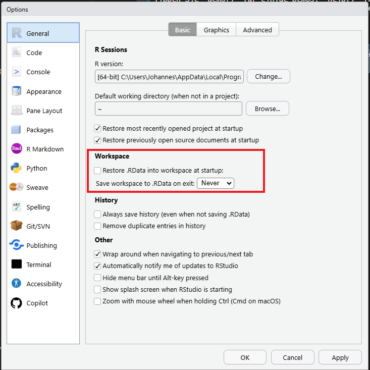

## Why make it reproducible?

- I have to rerun an analysis a few years down the line...

- My colleague wants to build on my analysis in a new study...

- I want to publish the code used in my study together with the manuscript so others can use it...

## What is reproducibility?

A study is reproducible if it can be

- conducted again
- years later
- with the same results.

## The replication crisis

Reproducibility =/= Replication

However, open methods and data are essential aspects for both.

Openly shared methods and data become valuable when we are given the same tools to work with as the authors.

## A first step toward reproducibility: a fresh start

Can I run my analysis tomorrow with the same results as today? Have I included all steps

--\> For a fresh start: make restarting R a habit

Session -\> Restart  or Strg + Shift + F10

## Never let Rstudio save anything!

Do not rely on `.RData` to bail you out. Either save interim datasets to files or write your script in a way that lets you start from scratch everytime.



or

``` r
#| eval: false
usethis::use_blank_slate()
```

<!-- ## How to achieve reproducibility? -->

<!-- ::: {.incremental} -->

<!-- - Einfrieren der   -->

<!-- - Versionskontrolle -->

<!-- ::: -->

## But it works on my machine!

Sharing your code and data is one step in the right direction.

To guarantee that others can apply them on their machine, you need to be able to share your **computational environment**.

 What is meant by computational environment: ::: {.fragment .highlight-red} - Specific  packages and their version ::: -  version - operating system (, , ) - system dependencies

## The `renv` package

`renv` is an R package that **freezes and records** the packages in your project in a project-specific library. This way, your project becomes **portable** and **reproducible** as you can use it on another computer or share it with a colleague. 

## `renv::init()`

## 

## Project files created by `renv`

```         
.
├── .Rprofile          # Project-specific profile, opens `renv` when project is opened
│
├── renv/
│   ├── .gitignore     # Specify which files should be ignored by git
│   ├── activate.R     # R script to launch renv
│   ├── library/       # Project library
│   └── settings.dcf   # `renv` settings
│
└── renv.lock          # the lockfile, containing package metadata
```

## `renv::snapshot()` & `renv::restore()`

Reproducibility is provided 

:::: {.columns}

::: {.column width="45%"}

- Initialize `renv` in the project with **`renv::init()`**
- Install new packages with **`renv::install()`**
- **Update the lockfile with `renv::snapshot()`**
- Share project with others, across computers

:::

::: {.column width=10%}
:::

::: {.column width="45%"}
Other person/computer

- **Restore project library from a lockfile w/ `renv::restore()`**
- \[ Use new packages in code \]
- \[ Install new packages w/ **`renv::install()`** \]
- ~~Update the lockfile w/ **`renv::snapshot()`**~~

:::

::::


## Measures for reproducibility

- Reproducible environments with R[renv](https://cran.r-project.org/web/packages/renv/index.html)
- literate programming using [Quarto](https://quarto.org/)
- publish study analysis and data as an R package

Outlook: - version control using git, Github, Gitlab, etc. - containerization with Docker or Nix

# Literate programming using Quarto

## Literate programming using Quarto

## Publishing Quarto documents

# Writing R packages

## Creating an R Package with the {usethis} package

One easy step to get started:

``` r
#| eval: false
usethis::create_package("/path/to/the/package")
```

## The process of working on a package

```{dot}
//| echo: false
digraph g1 {
layout="circo";
node [shape = rectangle];

A [label = "CMD check"]
B [label = "Build package"] 
C [label = "Write function"]  
D [label = "Document function"]
E [label = "Test function"]

A -> B ;
B -> C ;
C -> D ;
D -> E ;
E -> A ;
}
```

## Useful functions for package development

| Col1                  | Col2                     |
|-----------------------|--------------------------|
| Document function     | `devtools::document()`   |
| Load all functions    | `devtools::load_all()`   |
| CMD Check             | `devtools::check()`      |
| Build package locally | `devtools::build()`      |
| Declare dependencies  | `usethis::use_package()` |

: Table: Useful functions for packaged

## Exercise

I have prepared a small script with these functions that you can download here [script_package.R](%22https://www.johannesfeldhege.de/peergroup_workshop/script_package.R%22)

I want you to

## Pros of "study as an R package"

- Combines functions for analysis and study data
- documentation of custom functions, dependencies, contributors
- CMD check routine
- condense analysis into functions

## Cons of "study as an R package"

If the package is not intended for CRAN submission, superfluous information and files are created:

- metadata exists in different places (github, DESCRIPTION)
- CRAN submission artifacts
- compliance with CMD check requirements

More info [here](https://milesmcbain.xyz/posts/an-okay-idea/)

# Outlook

## Version control using Git, Github, Gitlab, etc.

Further reading: (Happy Git and GitHub for the useR)\[https://happygitwithr.com/\]

## R packages as research compendia

The idea of a research compendium combines a number of the previously discussed features:

- the R package structure
- literate programming with Quarto or Rmarkdown
- version control
- (optionally) the use of Docker and/or Binder

## R packages for creating research compendia

There are a number of R packages that implement research compendia:

::: nonincremental
- rrtools: <https://github.com/benmarwick/rrtools>
- SCIProj: <https://github.com/saskiaotto/SCIproj>
- template: <https://github.com/Pakillo/template>
:::
