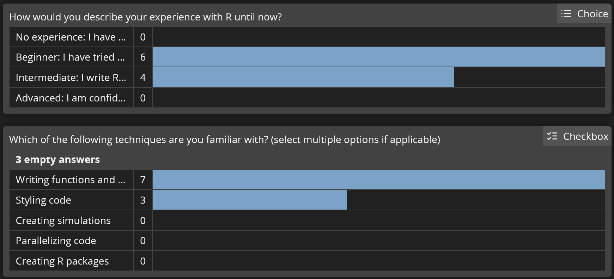
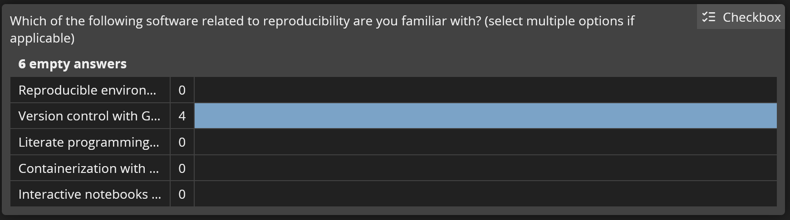
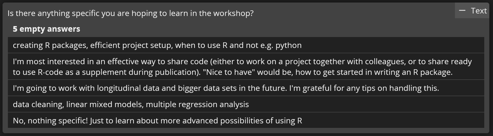

# About this workshop

## Housekeeping

All materials for the workshop (slides, scripts, references) can be found on this website:

<http://www.johannesfeldhege.de/peergroup_workshop/>

It is hosted on Github and has a permissive license so you can use them however you want.

## Requirements

To get the most out of this workshop, it is recommended to:

1.  Install recent versions of  and RStudio

2.  Install the following packages: `ds4psy`, `usethis`, `devtools`, `roxygen2`, `lintr`. They can be installed using the following code:

``` r
#| eval: false
install.packages(c("ds4psy", "lintr", "usethis", "devtools","roxygen2"))
```

3.  Create a new RStudio project for use in the workshop. 

## Timetable

| Time          | Content                                         |
|:--------------|:------------------------------------------------|
| 13:00 - 14:30 | Part 1: Reproducibile environments, Code style  |
| 14:30 - 14:45 | *Break*                                         |
| 14:45 - 17:00 | Part2: Literate programming, package development|


## About me

::: nonincremental
- M. Sc. in Psychology
- I used to work for Forschungsstelle für Psychotherapie
- I currently work as a Data Scientist at Asklepios Science & Research since 2022
- I use R at work daily
- I have published an R package on CRAN, [`openholidaysR`](https://cran.r-project.org/web/packages/openholidaysR/index.html) and I am currently working on a second one
:::


## Results from the pre-workshop survey



## Results from the pre-workshop survey



## Results from the pre-workshop survey



## Topics

Today's workshop will cover these topics:

- Making code easier to read
- first steps toward reproducibility
- Reproducible environments with [renv](https://cran.r-project.org/web/packages/renv/index.html)
- literate programming using [Quarto](https://quarto.org/)
- publish study analysis and data as an R package
- outlook for further reproducibility


## A dataset for today's workshop

```{webr-r}
?ds4psy::posPsy_AHI_CESD

pospsy <- ds4psy::posPsy_AHI_CESD
```


# Making code easier to read

## Making code easier to read

> Code is written once but read many times.

Therefore, we should try to improve readibility of our code.

Three measures you can take towards this goal:

- meaningful names
- consistent code style
- helpful comments

# Naming things

## Naming things

Naming things is hard - so hard that books are written about it:


## How to pick good names?


A good name should be

- descriptive and concise
- prioritize reader's understanding over shortness or machine compatibility
- follow a standard naming convention

## Naming conventions

Some commonly used conventions:

base 

:snake: snake_case

:camel: camelCase

``` r
#| eval: false

# base R
add.value()
reg.results

# snake_case
add_value()
reg_results

# camelCase
addValue()
regResults
```

## Examples for bad names

- `x`
- `new_data`
- `newnewdata`
- `lrmf`
- `logistic_regression_model_fit_result`

## Names for functions

The convention for functions in the tidyverse, a collection of related packages, is to start a function name with a verb, so `do()` or `do_thing()`. 

Examples:

``` r
#| eval: false

#Good 
add_value()

#Bad 
value_add()
value()
```

More style guidelines [here](https://style.tidyverse.org/functions.html)

# Styling code

## Styling code with `lintr`

[lintr](https://lintr.r-lib.org/) is a package for static code analysis on your R files.

Basic usage:

``` r
#| eval: false
# Style one file
lintr::lint(path = "path/to/file")

# A whole directory or R project
lintr::lint_dir(path = "path/to/project")
```

## Styling code with `lintr`

`lintr` comes with defaults.

```{webr-r}
names(lintr::linters_with_defaults())
```

These can be modified, deactivated, or you can define your own set.

You can also add your own linters.

## Beyond `lintr`

`lintr` gives recommendations but does not change code.

These tools can style your code by changing the code when executed:

::: nonincremental
- [Air](https://posit-dev.github.io/air/)
- [styler](https://styler.r-lib.org/)
:::

::: callout-warning
Caution: these tools change your code without asking!
:::

# Writing comments

## Writing helpful comments

> A helpful comment explains the why, not the what or how.

In

More info [here](https://blog.r-hub.io/2023/01/26/code-comments-self-explaining-code/) and [here](https://style.tidyverse.org/)

## Too many comments

If you find yourself commenting a lot, there might be better alternatives.

These are places where detailed comments on what and your code is doing for what reason are encouraged:

::: nonincremental
- convert your script to a  document such as Rmarkdown or Quarto
- incorporate your code into functions in a package and document them with roxygen2
:::

Both aspects will be covered in the second part of the workshop.


# Reproducibility

## Why make it reproducible?

- I have to rerun an analysis a few years down the line...

- My colleague wants to build on my analysis in a new study...

- I want to publish the code used in my study together with the manuscript so others can use it...

## What is reproducibility?

A study is reproducible if it can be

- conducted again
- years later
- with the same results.

## The replication crisis

Reproducibility =/= Replication

However, open methods and data are essential aspects for both.

Openly shared methods and data become valuable when we are given the same tools to work with as the authors.

## Measures for reproducibility

We will look at these measures today:

::: nonincremental
- Reproducible environments with [renv](https://cran.r-project.org/web/packages/renv/index.html)
- literate programming using [Quarto](https://quarto.org/)
- publish study analysis and data as an R package
:::


Outlook for further functionalities: 

::: nonincremental
- version control using git, Github, Gitlab, etc. 
- containerization with Docker, Nix, rix
- Research compendia
:::


# First steps toward reproducibility

## A fresh start

Can I run my analysis tomorrow with the same results as today? Have I included all steps in my code?

 For a fresh start: make restarting R during script writing a habit!

Session  Restart  

or 

Strg + Shift + F10


## Never let Rstudio save anything!

Do not rely on `.RData` to bail you out. Either save interim datasets to files or write your script in a way that lets you start from scratch every time.

Two options:

::::: columns
::: {.column width="60%"}
Change the RStudio options:

:::

::: {.column width="40%"}
Use this function from the `usethis` package:

```{r}
#| eval: false
usethis::use_blank_slate()
```
:::

:::::


# Freezing package versions

## But it works on my machine!

Sharing your code and data is one step in the right direction.

To guarantee that others can apply them on their machine, you need to be able to share your **computational environment**.

 What is the computational environment:

- Specific  packages and their version
-  version
- operating system ( , , ) ]
- system dependencies

## The `renv` package

`renv` controls in the computational environment:

- Specific  packages and their version
- [ version]{.fragment .strike}
- [operating system ( , , ) ]{.fragment .strike}
- [system dependencies]{.fragment .strike}


## The `renv` package

It **freezes and records** the actively used packages and their version in your project in a project-specific library.

This way, your project becomes **portable** and **reproducible** as you can use it on another computer or share it with a colleague.

The project is not affected by **changing functionality** or **breaking changes** in packages across versions. 

## Libraries in a regular setup

A library is the place where packages are installed. To check where your library is located, run `.libPaths()`. 

In a regular setup, all projects write to the same library. Therefore, packages can become out of sync with the projects that they have been used in.   

```{dot}
//| echo: false
digraph G {

    node [shape = folder];
    
    A [label = "Project 1"]
    B [label = "Project 2"]
    C [label = "Project 3"]
    D [label = "Package\nlibrary"]
  A -> D;
  B -> D;
  C -> D;
}
```


## Libraries with `renv`


Using `renv`, each project has its own library. When a new package is installed,
it is also written to a global package cache. The next time it is needed in a project, it is taken from there instead of downloading it again. 


```{dot}
//| echo: false
digraph G {

    node [shape = folder];
    
    A [label = "Project 1"]
    B [label = "Project 2"]
    C [label = "Project 3"]
    D [label = "Project\n library 1"]
    E [label = "Project\n library 2"]
    F [label = "Project\n library 3"]
    G [label = "Global\n package\n cache"]

  A -> D;
  B -> E;
  C -> F;
  D -> G;
  E -> G;
  F -> G;

}
```


## Important `renv` functions

| Task                     | function                 |
|--------------------------|--------------------------|
| Initialise `renv`        | `renv::init()`           |
| `renv` status            | `renv::status()`        |
| Install new package      | `renv::install()`       |
| Update project library   | `renv::snapshot()`      |
| Restore project library  | `renv::restore()`       |


## Initialise `renv` with `renv::init()`

 

## Project files created by `renv`

The following project files are created by `renv::init()`
```         
.
├── .Rprofile          # Project-specific profile, activates renv 
│
├── renv/
│   ├── .gitignore     # Specify which files should be ignored by git
│   ├── activate.R     # R script to launch renv
│   ├── library/       # Project library
│   └── settings.dcf   # renv settings
│
└── renv.lock          # the lockfile, containing package metadata
```


## Workflow with `renv`

Reproducibility can be achieved with the functions `renv::snapshot()` & `renv::restore()`

:::::: columns

::: {.column width="45%"}
**You**

::: nonincremental
- Initialize `renv` in the project with **`renv::init()`**
- Install new packages with `renv::install()`
- **Update the lockfile with `renv::snapshot()`**
- Share project with others or across computers
:::

:::

::: {.column width="10%"}
:::

::: {.column width="45%"}
**Other person/computer**

::: nonincremental
- **Restore project library from a lockfile with `renv::restore()`**
- Install new packages with `renv::install()`
- **Update the lockfile with `renv::snapshot()`**
:::

:::

::::::


