# Literate programming using Quarto

## Literate programming

::: small
> Literate programming is a methodology that combines a programming language with a documentation language, thereby making programs more robust, more portable, more easily maintained, and arguably more fun to write than programs that are written only in a high-level language. The main idea is to treat a program as a piece of literature, addressed to human beings rather than to a computer.

Donald E. Knuth, <https://www-cs-faculty.stanford.edu/~knuth/lp.html>

RMarkdown is a combination of the programming language  and the documentation language . It allows users to **combine R code with markdown-formatted text**.

Rmarkdown documents are **fully reproducible** as the R code contained within is executed when the document is rendered.
:::

## Literate programming using Quarto

Quarto is the successor to Rmarkdown, adding new features such as the option to include code from multiple programming languages or a wider set of output formats.

Quarto is included in recent versions of RStudio. To check whether it is installed and working on your machine, you can run in the terminal:

```{bash}
#| eval: false
quarto check
```

## Creating a Quarto document

::::: columns
::: {.column width="40%"}
In the RStudio menu:

File

 New file

 Quarto Document...
:::

::: {.column width="60%"}
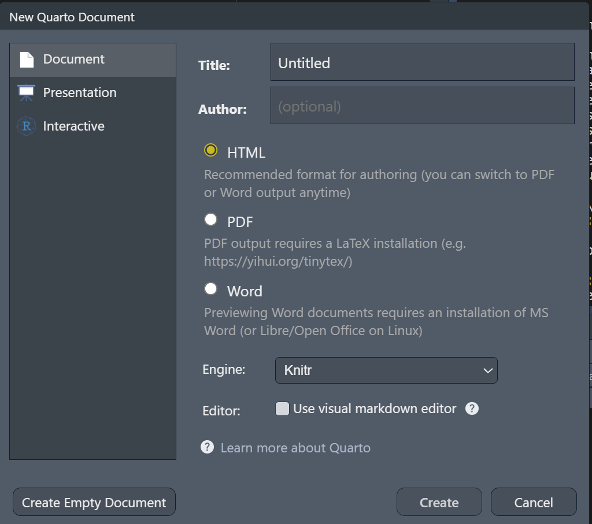
:::
:::::

## Anatomy of a Quarto document

:::::: columns
:::: {.column width="30%"}
A Quarto document consists of:

::: nonincremental
- a YAML header

- Markdown text

- Code chunks
:::
::::

::: {.column width="70%"}
```{bash}
#| eval: false
#| code-line-numbers: "|1-4|6-13|14-20|"
---
title: "Quarto Example Document"
format: html
---

## Markdown formatting

This is markdown formatted text. 

It can contain markdown specific format instructions such as ** for bold text. 

## Code chunks

````{r}
#| label: plot
#| fig-cap: CESD total across measurement occasions 
#| echo: true

boxplot(popsy$cesdTotal ~ popsy$occasion, horizontal = TRUE)
````
```
:::
::::::

## The YAML header

The text at the top between --- is called the YAML header. It supplies **instructions**, such as the output format, for **rendering the document**.

The instructions are specified as **key: value** pairs.

A simple example:

```{bash}
#| eval: false
---
title: "Quarto Example Document"
format: html
---
```

## The YAML header

A more elaborate version used to create this presentation:

::::: columns
::: {.column width="30%"}
Typical features are:

- a title

- an author

- format specific options
:::

::: {.column width="70%"}
```{bash}
#| eval: false
#| code-line-numbers: "|2|4|5-14|"
---
title: "Clean Code, Reproducible Science: Advanced R-Programming and Workflows"
subtitle: "Part 2"
author: "Johannes Feldhege"
format: 
  revealjs:
    theme: [simple]
    footer: <PPF Methods Peer Group>
    slide-number: true
    chalkboard: true
    code-link: true
    code-line-numbers: false
    incremental: true  
    from: markdown+emoji
engine: knitr
webr: 
  packages: ['ds4psy', 'dplyr']
filters:
  - webr
---
```
:::
:::::

## Markdown formatting

:::::: columns
:::: {.column .small width="50%"}
`#` are used to create headers. The number of `#` determines the header level.

::: nonincremental
- Bullet list item 1

- Bullest list item 2
:::

**bold text**, *italic text*

`text formatted as code`
::::

::: {.column width="50%"}
```{bash}
#| eval: false
#| code-line-numbers: "|1-3|5-7|9-11|"

# Header 1

## Header 2

- Bullet list item 1

- Bullest list item 2

**bold text**, *italic text*

 `text formatted as code`
```
:::
::::::


## Source vs Visual Editor

You can switch between source and a visual editor when writing your Quarto document. 

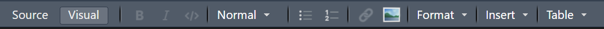

In visual editor mode, you get a preview of your document. It is a more beginner-friendly mode as you get a more immediate feedback on your inputs.  

 Switching between both modes can sometimes introduce unintended changes in the document!


## Visual Editor mode

::: {.small}
In Visual Editor mode, you can select and insert formatting or special inputs using the dropdown menus: 
:::


:::: {.columns}

::: {.column width="50%"}
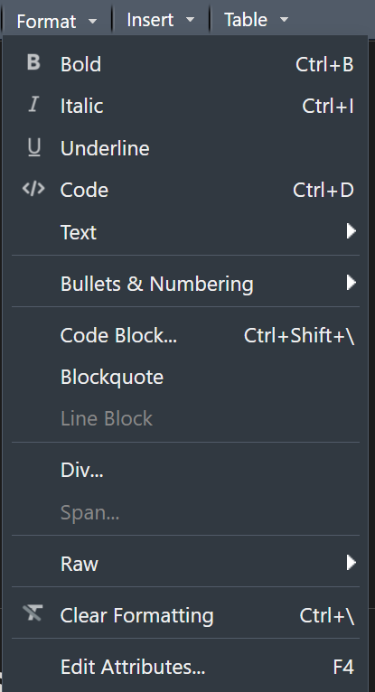

:::

::: {.column width="50%"}
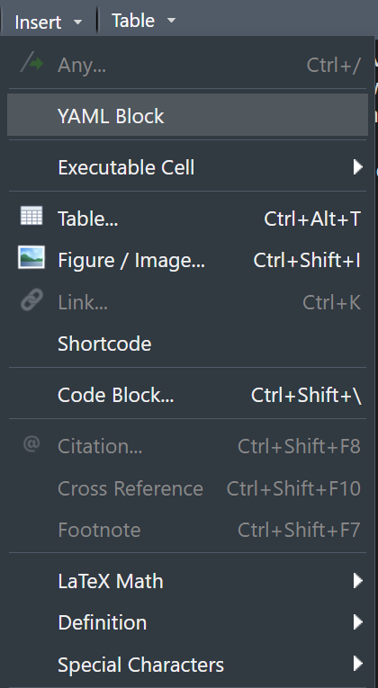
:::

::::


## Code chunks

::: panel-tabset
## Explanation

Code chunks contain programming code as well as instructions on how to execute the code and place it and its results in the Quarto document. 

The first line must specify the **programming language**.

**Instructions** are placed in comments with `#`|. 

The actual code can be written as you would in a regular script. 

## Code


```{bash}
#| eval: false
#| code-line-numbers: "|1|2|3|4|5|7-9|"

````{r}
#| echo: true
#| label: plot1
#| fig-cap: CESD total across measurement occasions 
#| fig-width: 5

library(ds4psy)

pospy <- ds4psy::posPsy_long

boxplot(popsy$cesdTotal ~ popsy$occasion, horizontal = TRUE)
````

```
:::


## A note on code execution

::: small
> Rmarkdown documents are fully reproducible as the R code contained within is executed when the document is rendered.
:::

 Quarto documents are rendered in a process that is separate to your RStudio environment, therefore they cannot access currently loaded packages or your carefully created datasets.

 You need to load packages and data inside a code chunk in order to use them!


## Rendering a document

To turn a Quarto document into the desired output format, it needs to be rendered.

::::: columns
::: {.column width="50%"}
This can be done using RStudio buttons:

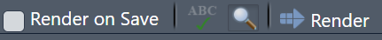
:::

::: {.column width="50%"}
or in the terminal:

```{bash}
#| eval: false
quarto render my_quarto_file.qmd
```

or in R with the `quarto`  package:

```{bash}
#| eval: false
quarto::render("my_quarto_file.qmd")
```
:::
:::::


## Output formats

Quarto documents can be rendered to dozens of different output formats:

-  HTML pages

-  Word documents

-  PDFs

-  Websites

-  Books

- and more...


## Quarto manuscripts

Quarto 1.4 introduced an output format for scientific writing: **Quarto manuscripts**.

It is published as a website that can link to other formats such as **word** or **pdf**.

In the background, multiple Quarto files can be used to write the manuscript and conduct the analysis.

A live example can be seen [here](https://quarto-ext.github.io/manuscript-template-jupyter/)


## Exercise

I have created an example Quarto document that you can download [here](https://github.com/jfeldhege/peergroup_workshop/blob/main/examples/quarto_example.qmd)

::: nonincremental
- play around with the markdown formatting
- change the code chunk for the plot and table
- create a new plot or table
- render the document
:::


# Creating R packages

## R packages in a reproducibility context 

:::: {.columns}

::: {.column width="30%"}
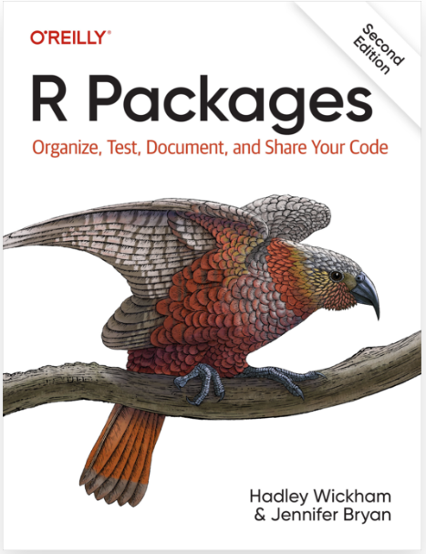
:::

::: {.column width="70%"}
>Packages are the fundamental units of reproducible R code. They include reusable R functions, the documentation that describes how to use them, and sample data.

::: {.right}
\- Wickham and Bryan, 2023
:::
:::

::::


## Two essential packages

:::: {.columns}

::: {.column width="20%"}
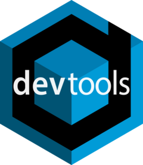{height=150}

{height=150}
:::

::: {.column width="80%"}
`devtools`: Essential functions for documenting code and building the package.

<br />

`usethis`: Convenience function to automate the workflow of creating a package. 
:::

::::


## Creating an R Package with the `usethis` package

One easy step to get started:

```{r}
#| eval: false
usethis::create_package("/path/to/the/package/name")
```


 A package name may only contain letters, numbers, and \.


## The package directory structure

```         
.
├── (.gitignore)        # Files to ignore when using git
│
├── .Rbuildignore       # Files to ignore when building package
│
├── R/                  # Folder to store (only) R functions
│   └── myfun-1.R       # A first R function file
│
├── man/                # Folder to store R functions documentation
│   └── my_fun_1.Rd     # Documentation for the first function
│
├── DESCRIPTION         # Package metadata
│
└── NAMESPACE           # Automatically edited
```


## The DESCRIPTION

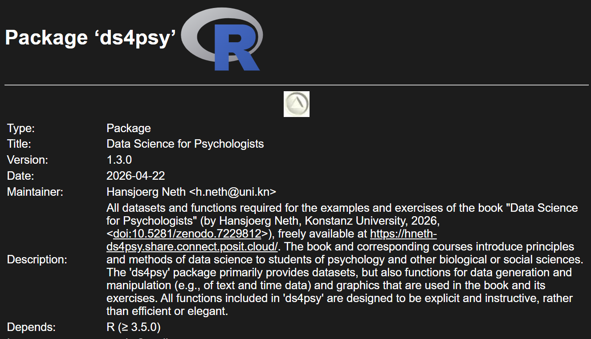

## The DESCRIPTION

The DESCRIPTION file can be edited by hand, but `usethis` also provides functions to programmatically edit its:

| task                 | function                     |
|----------------------|------------------------------|
| Declare dependencies | `usethis::use_package()`     |
| Adding authors       | `usethis::use_author()`      |
| Edit DESCRIPTION     | `usethis::use_description()` |


## Exercise

I have prepared a small script with these functions that you can download: [script_package_01.R](%22https://www.johannesfeldhege.de/peergroup_workshop/script_package_01.R%22)

I want you to execute these functions to create a package and write metadata to its DESCRIPTION.

Check out the directory structure and the different files that have been created.

## The process of working on a package

```{dot}
//| echo: false
digraph g1 {
layout = "dot";
overlap = false
node [shape = oval];

D [label = "Write function"]  
E [label = "Document function"]
F [label = "Test function"]
A [label = "CMD check"]
B [label = "Build package"] 
C [label = "Install package"]


D -> E ; 
E -> F ;
F -> D ;

F -> A ;
A -> D ;
A -> B ;
B -> C ;

}
```


## Useful functions for package development

| task                  | function               |
|-----------------------|------------------------|
| Create R script       | `usethis::use_r()`     |
| Add data              | `usethis::use_data()`  |
| Document function     | `devtools::document()` |
| Load all functions    | `devtools::load_all()` |
| CMD Check             | `devtools::check()`    |
| Build package locally | `devtools::build()`    |


## Documenting functions with `roxygen2`

:::: {.columns}

::: {.column width="20%"}
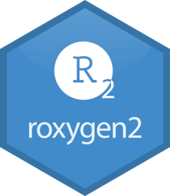
:::

::: {.column width="80%"}
The idea behind `roxygen2` is to document functions with special comments next to their definition. `roxygen2` will process these comments and turn them into **manual pages** in the package.

You can add a comment skeleton with **control + alt + shift + R** when your cursor is inside the function.
:::

::::


## `roxygen2` comments

```{bash}
#| eval: false
#| code-line-numbers: "|1|3-6|8|9-10|12|13-16|"

#' The length of a string
#'
#' Technically this returns the number of "code points", in a string. One
#' code point usually corresponds to one character, but not always. For example,
#' an u with a umlaut might be represented as a single character or as the
#' combination a u and an umlaut.
#'
#' @param string A text string
#' @return A numeric vector giving number of characters (code points) in each
#'    element of the character vector. Missing string have missing length.
#' @seealso [stringi::stri_length()] which this function wraps.
#' @export
#' @examples
#' str_length(letters)
#' str_length(NA)
#' str_length(factor("abc"))
str_length <- function(string) {
}
```


## R CMD Check

::: panel-tabset
## Three levels of feedback

::: {.small}
R CMD check runs checks intended for publication on CRAN. Its output gives **strict feedback**:

-  errors need to be fixed

-  warnings affect functionality

-  notes can often be ignored if you do not intend to publish the package on CRAN

:::

## An example output 

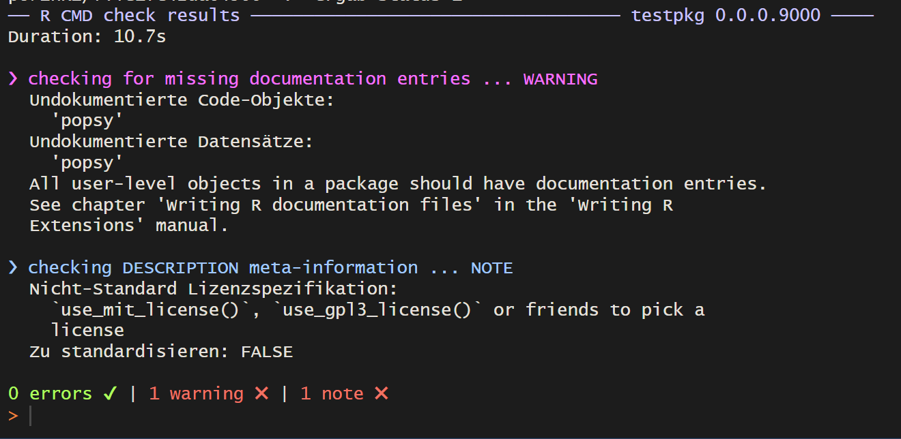
:::


## Exercise

::: {.small}
I have prepared a small script with functions that you can download: [script_package_02.R](%22https://www.johannesfeldhege.de/peergroup_workshop/script_package_03.R%22)

I want you to

- create a function that changes the values of the CESD to be in the range [0, 3]
- add some documentation to the function using `roxygen2`
- Load the package and test the function
- Run CMD Check
- Build the package and install it

Optional:

- add the dataset from the function `ds4psy::posPsy_long()` to the package using `usethis::use_data()`
:::


## Pros of "study as an R package"

- Combines functions for analysis and study data
- documentation of custom functions, dependencies, contributors
- CMD check routine
- condense analysis into functions

## Cons of "study as an R package"

If the package is not intended for CRAN submission, superfluous information and files are created:

- metadata exists in different places (github, DESCRIPTION)
- CRAN submission artifacts
- compliance with CMD check requirements

More info [here](https://milesmcbain.xyz/posts/an-okay-idea/)


# Outlook

# Version control

## Sharing files with collaborators

Two common scenarios:

- Paper_260510_final_final.doc: files are sent via e-mail and **multiple versions** exist out there.

- An online document (Google docs, Microsoft 365, etc.): anyone can edit, anyone can see and track changes. **Changes can be reverted back**.

 Version control is more like the second scenario.

## Version control using Git 

 manages a **repository**, a collection of files, and their changes over time. In the  world, this corresponds to a RStudio project or a folder with scripts and datasets.

When you make a change, you *commit* it with a short message detailing your changes. All these commits make up the *history* of the repository, through which you can trace back the evolution of your project.


## Git clients such as Github, Gitlab, etc.

When your version controlled repository is not confined to your machine, **hosting services** such as Github , Gitlab  or others come into play. You can:

- publish your project there
- *push* your changes to the repository
- accept changes from others made in *pull* requests

## Hosting Quarto documents

Github and Gitlab let you host webpages and websites created in a repository on their service for free.

This can be used to publish Quarto documents, books, websites.

I have put this to use for my own website, for documentation for my R package, and for this workshop!

## Further reading

::: nonincremental
- [Happy Git and GitHub for the useR](https://happygitwithr.com/)
:::

# Containerization

## The purpose of containerization

With **containerization**, you can control all of the aspects of the computational environment mentioned earlier:

- Specific  packages and their version
-  version
- operating system ( , , )
- system dependencies

## What is a container?

A container is little bit like a virtual machine as it is a separate computer running on another computer. However, it usually does not have a graphical interface, but is run through a terminal.

The container is the running instance of the computer. How this computer is set up is defined by the **image**.

## What is an image?

An image is a package that contains all necessary instructions to create a container. 

The specifications for an image is defined in a text file, e.g. a Docker file:

::: nonincremental
- what operating system is needed
- what software needs to be installed
:::

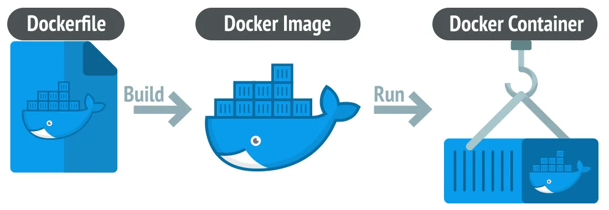

## Collaboration

The image can be shared with collaborators so that they can reproduce the same conditions on a container on their computer.

There are a number of standard images for R created by the [Rocker Project](https://rocker-project.org/). These can be used as a base image which can then be further customised for a specific project.

## Further reading

Books:

::: nonincremental
- [An Introduction to Docker for R Users](https://colinfay.me/docker-r-reproducibility/)
- [Building reproducible analytical pipelines with R](https://raps-with-r.dev/)
:::

Other implementations:

::: nonincremental
- [Binder](https://mybinder.org/)
- [rix](https://docs.ropensci.org/rix/)
:::

# Research Compendia

## What are research compendia?

> A research compendium collects all digital parts of a research project, including data, code, and texts (protocols, reports, questionnaires, metadata).

::: {.right .small}
https://epiverse-trace.github.io/research-compendium/instructor/compendium.html
:::

When published, a research compendium allows others to inspect, reconstruct and ideally execute your analysis. .

## R packages as research compendia

The idea of a research compendium combines a number of the previously discussed features:

- the R package structure
- literate programming with Quarto or Rmarkdown
- version control
- (optionally) the use of Docker and/or Binder

## Further reading

There are a number of R packages that implement research compendia:

::: nonincremental
- rrtools: <https://github.com/benmarwick/rrtools>
- SCIProj: <https://github.com/saskiaotto/SCIproj>
- template: <https://github.com/Pakillo/template>
:::

Further information:

::: nonincremental
- <https://research-compendium.science/>
- <https://book.the-turing-way.org/reproducible-research/compendia/>
:::


# Thank you for attention!
